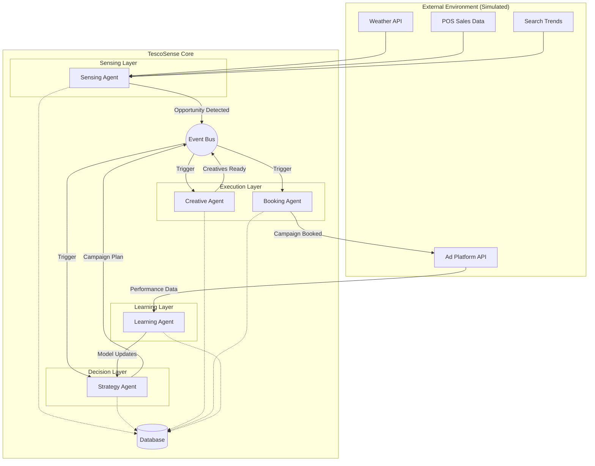

# TescoSense Architecture Documentation

## 1. High-Level Architecture

TescoSense is a closed-loop multi-agent system designed to autonomously manage retail media campaigns.

### System Block Diagram

### Microservices Decomposition

1.  **Backend Service (FastAPI)**: Hosts all agents, API endpoints, and simulation logic.
2.  **Frontend Service (Next.js)**: User interface for monitoring and control.
3.  **Database (PostgreSQL/SQLite)**: Persistent storage for campaigns, logs, and models.
4.  **Message Broker (Internal Asyncio/Redis)**: Handles inter-agent communication.

---

## 2. Agent Specifications

### 1. Sensing Agent

- **Role**: Monitor data streams for anomalies and opportunities.
- **Inputs**: Weather feeds, Sales data, Search trends.
- **Outputs**: `Opportunity` events.
- **Algorithm**:
  - Ingest data stream.
  - Run Anomaly Detection (Z-Score / Isolation Forest).
  - If `score > threshold`, emit `Opportunity`.
- **Example Trigger**: "Soup sales down 10% AND Weather forecast = Heavy Rain next 3 days" -> Opportunity: "Boost Soup Ad Spend".

### 2. Strategy Agent

- **Role**: Formulate campaign strategy based on opportunities.
- **Inputs**: `Opportunity` event, Budget constraints, Historical performance.
- **Outputs**: `CampaignPlan`.
- **Algorithm**:
  - Analyze Opportunity type.
  - Select target audience and channels.
  - Allocate budget (Linear Optimization or Heuristic).
  - Predict ROI (Forecasting Model).

### 3. Creative Agent

- **Role**: Generate ad assets.
- **Inputs**: `CampaignPlan`.
- **Outputs**: `CreativeAssets` (Headlines, Image URLs).
- **Algorithm**:
  - Construct prompt based on Product + Context (e.g., "Hot soup for rainy day").
  - Call LLM (Mocked) for copy.
  - Call Image Gen (Mocked) for visuals.

### 4. Booking Agent

- **Role**: Execute the campaign on ad platforms.
- **Inputs**: `CampaignPlan`, `CreativeAssets`.
- **Outputs**: `BookingConfirmation`.
- **Algorithm**:
  - Validate budget and assets.
  - Call Ad Platform API (Mock).
  - Record transaction ID.

### 5. Learning Agent

- **Role**: Close the loop by analyzing performance.
- **Inputs**: Campaign Performance Data (CTR, ROAS).
- **Outputs**: Model Weights Update / Strategy Adjustment.
- **Algorithm**:
  - Compare Actual vs Predicted ROI.
  - Update internal weights/rules (Reinforcement Learning stub).

---

## 3. Data Models

### Campaign

- `id`: UUID
- `name`: String
- `status`: Enum (PLANNED, ACTIVE, COMPLETED)
- `budget`: Float
- `target_audience`: JSON
- `created_at`: Timestamp

### Creative

- `id`: UUID
- `campaign_id`: UUID
- `headline`: String
- `image_url`: String
- `type`: String

### PerformanceLog

- `id`: UUID
- `campaign_id`: UUID
- `impressions`: Integer
- `clicks`: Integer
- `spend`: Float
- `timestamp`: Timestamp

---

## 4. API Specifications

### REST API

- `POST /simulation/trigger`: Manually trigger a data event (e.g., "Heatwave").
- `GET /campaigns`: List all campaigns.
- `GET /trends`: Get current detected trends.
- `POST /agents/reset`: Reset agent states.

### WebSocket

- `/ws/dashboard`: Real-time updates for the frontend dashboard.
